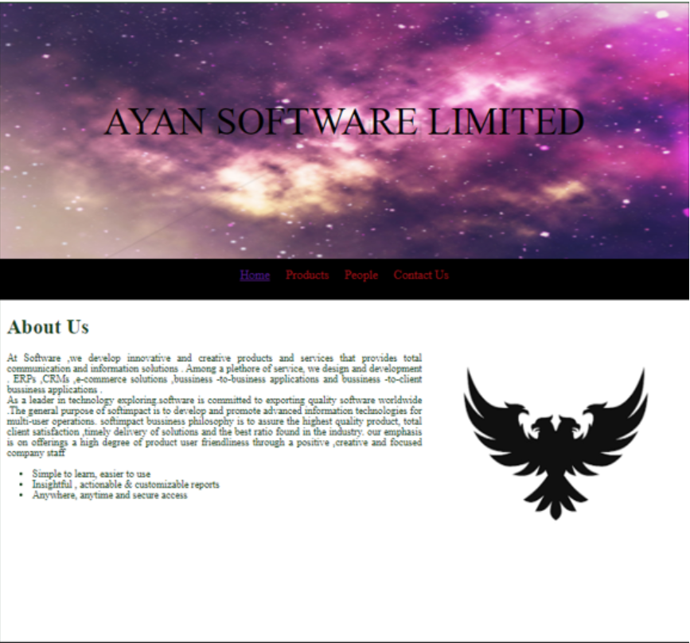
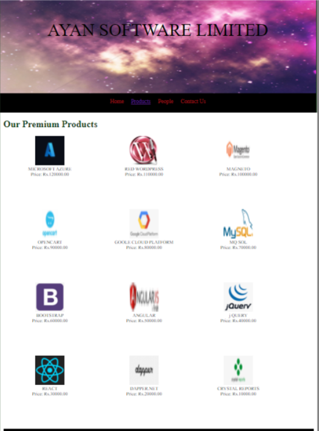
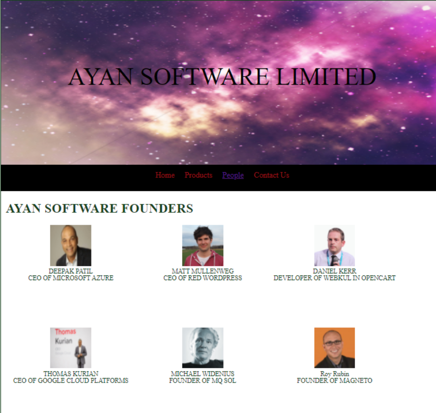
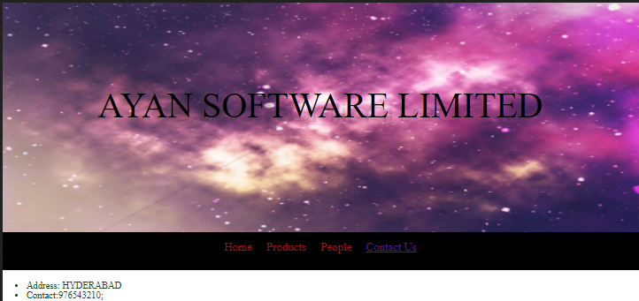

# Web Design for a Software Product Company

## AIM:

To design a static website for a software product company company.

## DESIGN STEPS:

### Step 1:

Requirement collection.

### Step 2:

Creating the layout using HTML and CSS.

### Step 3:

Updating the sample content.

### Step 4:

Choose the appropriate style and color scheme.

### Step 5:

Validate the layout in various browsers.

### Step 6:

Validate the HTML code.

### Step 6:

Publish the website in the given URL.

## PROGRAM :
```
<!DOCTYPE html>
<html lang="en">
  <head>
    <title>AYAN SOFTWARE LIMITED</title>
    <link rel="stylesheet" href="./css/layout.css" />
    <link rel="icon" href="./img/Eagle.png" type="image/x-icon" />
  </head>

  <body>
    <div class="container">
      <div class="banner">AYAN SOFTWARE LIMITED</div>
      <div class="menu">
        <div class="menuitemselected"><a href="/static\home.html">Home</a></div>
        <div class="menuitem"><a href="/static\products.html">Products</a></div>
        <div class="menuitem"><a href="/static\people.html">People</a></div>
        <div class="menuitem"><a href="/static\contact_us.html">Contact Us</a></div>
      </div>
      <div class="content">
        <div class="homecontent">
          <h1>About Us</h1>
          
          <div class="contenttext">
           At Software ,we develop innovative and creative products and services that 
           provides total communication and information solutions .
           Among a plethore of service, we design and development . ERPs ,CRMs ,e-commerce 
           solutions ,bussiness -to-business applications and bussiness -to-client bussiness
           applications .
            <br />
           As a leader in technology exploring.software is committed to exporting quality 
           software worldwide .The general purpose of softimpact is to develop and promote 
           advanced information technologies for multi-user operations.
           softimpact bussiness philosophy is to assure the highest quality product,
           total client satisfaction ,timely delivery of solutions and the best ratio
           found in the industry. our emphasis is on offerings a high degree of product 
           user friendliness through a positive ,creative and focused company staff           
           <div class=""></div>
            <ul>
              <li>Simple to learn, easier to use</li>
              <li>Insightful , actionable & customizable reports</li>
              <li>Anywhere, anytime and secure access</li>
            </ul>
          </div>
        </div>
      </div>
      <div class="footer">
        Copyright&#169;2021 AYAN SOFTWARE LIMITED FOUNDER:V.NAVYA
       </div>
      </div>
    </body>
  </html>
  Product page:
  <!DOCTYPE html>
<html lang="en">
  <head>
    <title>AYAN SOFTWRE LIMITED</title>
    <link rel="stylesheet" href="./css/layout.css" />
    <link rel="icon" href="./img/icon.png" type="image/x-icon" />
  </head>

  <body>
    <div class="container">
      <div class="banner">AYAN SOFTWARE LIMITED</div>
      <div class="menu">
        <div class="menuitem"><a href="/static/home.html">Home</a></div>
        <div class="menuitemselected"><a href="/static/products.html">Products</a></div>
        <div class="menuitem"><a href="/static/people.html">People</a></div>
        <div class="menuitem"><a href="/static/contact_us.html">Contact Us</a></div>
      </div>
      <div class="content">
        <div class="productcontent">    
          <h1>Our Premium Products</h1>
          <div class="productitems">
              <div class="productitem"> 
                  <div class="itemimage">
                  
                  </div>
                  <div class="itemname">MICROSOFT AZURE</div>
                  <div class="itemprice">Price: Rs.120000.00 </div>
              </div>
              <div class="productitem"> 
                  <div class="itemimage">
                  
                  </div>
                  <div class="itemname">RED WORDPRESS</div>
                  <div class="itemprice">Price: Rs.110000.00 </div>
              </div>
              <div class="productitem"> 
                <div class="itemimage">
                
                </div>
                <div class="itemname">MAGNETO</div>
                <div class="itemprice">Price: Rs.100000.00 </div>
          </div>
          <div class="productitem"> 
            <div class="itemimage">
            
            </div>
            <div class="itemname">OPENCART</div>
            <div class="itemprice">Price: Rs.90000.00 </div>
          </div>  
          <div class="productitem"> 
            <div class="itemimage">
            
            </div>
            <div class="itemname">GOOLE CLOUD PLATFORM</div>
            <div class="itemprice">Price: Rs.80000.00 </div>      
      </div>
      <div class="productitem"> 
        <div class="itemimage">
        
        </div>
        <div class="itemname">MQ SOL</div>
        <div class="itemprice">Price: Rs.70000.00 </div>
        </div>
        <div class="productitem"> 
          <div class="itemimage">
          
          </div>
          <div class="itemname">BOOTSTRAP</div>
          <div class="itemprice">Price: Rs.60000.00 </div>
          </div>
          <div class="productitem"> 
            <div class="itemimage">
            
            </div>
            <div class="itemname">ANGULAR</div>
            <div class="itemprice">Price: Rs.50000.00 </div>
            </div>
            <div class="productitem"> 
              <div class="itemimage">
              
              </div>
              <div class="itemname">j QUERY</div>
              <div class="itemprice">Price: Rs.40000.00 </div>
              </div>
              <div class="productitem"> 
                <div class="itemimage">
                
                </div>
                <div class="itemname">REACT</div>
                <div class="itemprice">Price: Rs.30000.00 </div>
                </div>
                  <div class="productitem"> 
                    <div class="itemimage">
                    
                    </div>
                    <div class="itemname">DAPPER.NET</div>
                    <div class="itemprice">Price: Rs.20000.00 </div>
                    </div>
                    <div class="productitem"> 
                      <div class="itemimage">
                      
                      </div>
                      <div class="itemname">CRYSTAL REPORTS</div>
                      <div class="itemprice">Price: Rs.10000.00 </div>
                      </div>
      <div class="footer">
        Copyright &#169; 2021 AYAN SOFTWARE LIMITED FOUNDER:V.NAVYA
      </div>
    </div>
  </body>
</html>
people page:
      <!DOCTYPE html>
<html lang="en">
  <head>
    <title>AYAN SOFTWARE LIMITED</title>
    <link rel="stylesheet" href="./css/layout.css" />
    <link rel="icon" href="./img/icon.png" type="image/x-icon" />
  </head>

  <body>
    <div class="container">
      <div class="banner">AYAN SOFTWARE LIMITED</div>
      <div class="menu">
        <div class="menuitem"><a href="/static/home.html">Home</a></div>
        <div class="menuitem"><a href="/static/products.html">Products</a></div>
        <div class="menuitemselected"><a href="/static/people.html">People</a></div>
        <div class="menuitem"><a href="/static/contact_us.html">Contact Us</a></div>
      </div>
      <div class="content">
        <div class="productcontent">    
            <h1>AYAN  SOFTWARE FOUNDERS </h1>
            <div class="productitems">
                <div class="productitem"> 
                    <div class="itemimage">
                    
                    </div>
                    <div class="itemname">DEEPAK PATIL</div>
                    <div class="itemprice">CEO OF MICROSOFT AZURE</div>
                </div>
                <div class="productitem"> 
                    <div class="itemimage">
                    
                    </div>
                    <div class="itemname">MATT MULLENWEG</div>
                    <div class="itemprice">CEO OF RED WORDPRESS  </div>
                </div>
                <div class="productitem"> 
                    <div class="itemimage">
                    
                    </div>
                    <div class="itemname">DANIEL KERR</div>
                    <div class="itemprice">DEVELOPER OF WEBKUL IN OPENCART</div>
                </div>
                <div class="productitem"> 
                    <div class="itemimage">
                    
                    </div>
                    <div class="itemname">THOMAS KURIAN</div>
                    <div class="itemprice">CEO OF GOOGLE CLOUD PLATFORMS</div>
                </div>
                <div class="productitem"> 
                    <div class="itemimage">
                    
                    </div>
                    <div class="itemname">MICHAEL WIDENIUS</div>
                    <div class="itemprice">FOUNDER OF MQ SOL</div>
                </div>
                <div class="productitem"> 
                    <div class="itemimage">
                    
                    </div>
                    <div class="itemname">Roy Rubin</div>
                    <div class="itemprice">FOUNDER OF MAGNETO</div>
                </div>

          </div>
        </div>
      </div>
      <div class="footer">
        Copyright &#169; 2021 AYAN SOFTWARE LIMITED FOUNDER:V.NAVYA
      </div>
    </div>
  </body>
</html>
 contact page:
      <!DOCTYPE html>
<html lang="en">
  <head>
    <title>AYAN SOFTWARE LIMITED</title>
    <link rel="stylesheet" href="./css/layout.css" />
    <link rel="icon" href="./img/icon.png" type="image/x-icon" />
  </head>

  <body>
    <div class="container">
      <div class="banner">AYAN SOFTWARE LIMITED</div>
      <div class="menu">
        <div class="menuitem"><a href="/static/home.html">Home</a></div>
        <div class="menuitem"><a href="/static/products.html">Products</a></div>
        <div class="menuitem"><a href="/static/people.html">People</a></div>
        <div class="menuitemselected"><a href="/static/contact_us.html">Contact Us</a></div>
      </div>
      <div class="content">
          <ul>
              <li>Address: HYDERABAD <br></li>
              <li>Contact:976543210;<br></li>
              <li>navyavenkat03@gmail.com.com<br></li>
              <br>VERIFIED*
          </ul>    
        </div>
    </div>
    </div>
    </div>
      <div class="footer">
        Copyright &#169; 2021 AYAN SOFTWARE LIMITED FOUNDER:V,NAVYA
      </div>
    </div>
  </body>
</html>
```
## OUTPUT:





## Result:

Thus a website is designed for the software product company and the HTML,CSS code are validated.
